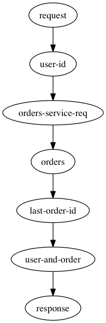
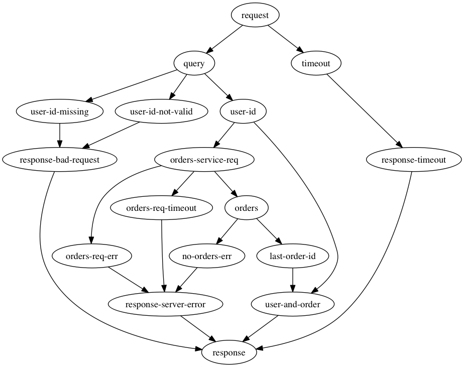
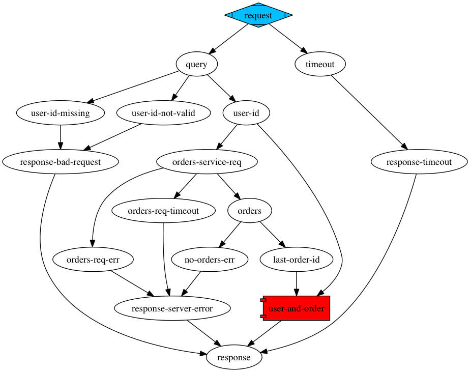
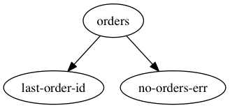

# iokov

Task as a list of rules - iokov allows you to describe your task a set
of independent rules which runs when input is available and produces
the output that others rules can process.

## Thinking

Imagine you was given a task to create a new microservice and like
always it's just a few sentences:

```
REST service should accepts userID, call another service 'Orders' in
order to get all user orders and return most recent orderID with original userID
```

Workflow is dramatically simple:



Or is it? We completely ignored error handling, let's write down a few:

- `HTTP 400 Bad Request` when:
  - UserId wasn't presented in HTTP request
  - UserId doesn't pass validation e.g. empty string, has not valid
    symbols
- `HTTP 500 Server Error` when:
  - `Orders` HTTP request end up with an error
  - `Orders` HTTP request didn't finish in time and timeout error was
    generated
  - Our server wasn't able to generate response in certain time -
    timeout occurred and the error should be returned
  - `Orders` returned empty list of orders, we cannot get orderID and
    should return error

It could be much more complex than that and we can improve it: Return
specific code when there are no orders, maybe `Orders` service may return
specific error when user doesn't exists and we should replicate in our
service, maybe we should include link to our service documentation
when bad request happens in the body, etc. So far let's stick with
this, but we will make sure that we can extend it in a feature. Let's
visualize it once more:



It may look complex, but this image is actually very important: It shown the exact logic that
our service has to follow. We can discuss this image with colleagues
and got an approval from managers about the logic. We didn't write any
lines of code but already found many issues like in the case when no
orders exists. Think about this graph as a visual proof that your service logic is right.

This is neat, how can we generate images like this? We can write each
workflow step (let's name it a `rule`) as pairs of input and outputs. Input/output can be
either keyword or a vector of keywords if multiple connection are
needed. Later on we can call `iokov.view/render-flow` in order to
generate an image:

``` clojure

(render-flow [[:request [:timeout :query]]
              [:query [:user-id-missing :user-id-not-valid :user-id]]
              [:timeout :response-timeout]
              [:user-id :orders-service-req]
              [:orders-service-req [:orders-req-err :orders-req-timeout :orders]]
              [:orders [:last-order-id :no-orders-err]]
              [[:user-id :last-order-id] :user-and-order]
              [[:user-id-missing :user-id-not-valid] :response-bad-request]
              [[:orders-req-err :orders-req-timeout :no-orders-err] :response-server-error]
              [[:response-timeout :response-bad-request :response-server-error :user-and-order] :response]])
```

There are actually some information missing from the graph: In certain cases input can generate only one of the outputs (for example `:orders` can be processed into either `:last-order-id` or `:no-orders-err`) while in other cases all input keys has to be available in order to proceed (like `:user-and-order` can be processed when both `:user-id` and `:last-order-id` is presented). Let's add such data to our rules using following info:
- Rule needs all the input keys to be available - `:join`
- Rule produces all the output keys - `:fork`
- All the rest - `:alts`

Let's write in down and generate new graph image using this time `iokov.view/render`:

``` clojure
(render [[:fork :request [:timeout :query]]
         [:alts :query [:user-id-missing :user-id-not-valid :user-id]]
         [:alts :timeout :response-timeout]
         [:alts :user-id :orders-service-req]
         [:alts :orders-service-req [:orders-req-err :orders-req-timeout :orders]]
         [:alts :orders [:last-order-id :no-orders-err]]
         [:join [:user-id :last-order-id] :user-and-order]
         [:alts [:user-id-missing :user-id-not-valid] :response-bad-request]
         [:alts [:orders-req-err :orders-req-timeout :no-orders-err] :response-server-error]
         [:alts [:response-timeout :response-bad-request :response-server-error :user-and-order] :response]])
```



Nice, we have all the needed information in our data structure and in the output image. This is a great achievement already - we were able to represent complete logic of our service using just simple vector which bunch of keywords. We can easily add new rules, change the existing one or maybe completely re structure out workflow. 

But can we get anything else from it? Can we actually use it in our service?

## Doing

What is actually left before we can say that the service is done? Well, it's just a bunch of keywords, we have no logic which processes it, so let's have a look how we can make it but using just a small subset of the original rules:

``` clojure
(render [[:alts :orders [:no-orders-err :last-order-id]]])
````



Let's think how we can implement function that can process such rule. Basically it should look like `f(input) -> output` like the following:

``` clojure
(defn orders [{:keys [orders]}]
    (if (pos? (count orders))
      {:last-order-id (->> orders (sort-by :created) last)}
      {:no-orders-err "No orders found"}))
```

How can we associate this function with our rule? Just put it as a last item in the rule vector and that is it! Time to run the whole thing! Let's use `iokov.core/iokov` function which accept initial state and array of rules. iokov will start executing your workflow in the right order and return you a value of the latest executed rule when no more rules can be run, or nil if there are no rules exists:

``` clojure

(def workflow [[:alts :orders [:no-orders-err :last-order-id] orders]])
(iokov {:orders [{:id 1 :created 0}]} workflow) ;; Returns {:id 1 :created 0}
(iokov {:orders []} workflow) ;; Returns "No orders found"
(iokov {} workflow) ;; Returns nil
```

Nice, but in `orders` function all this input maps destructing, returning different maps made some sense. But what if we have a rule like `[:alts :no-orders-err :response-server-error]`? In this case we actually don't care about input at all on this stage of development - we just want to return error response like `{:status 400 :body "Request is not valid"}`. Let's have a look what iokov expects from the rule. iokov rule is a collection of values:
- Rule type one of `[:alts :join :fork]`
- Input as either keyword or a collection of keyword
- Output as either keyword or a collection of keywords
- Rule function `f(input) -> output`

And the rest of the rule vector may be different handlers. Following handlers are available from the `iokov.handlers`:

- callback-handler - allows to use rule function which accepts input data and a callback
- promise-handler - pass input to your function which returns Promise and attaches resolve handler to it
- time-handler - logs transition between different state into atom with time expired
- log-handler - logs transition between different state to console or using your custom function
- lift - allows to use simple function - selects input map values, passes it to your function, gets the output and use it with output key. If rule function is a value - uses that as a value of the output key

Using lift we can finally specify our new rule:

``` clojure
[:alts :no-orders-err :response-server-error {:status 400 :body "Request is not valid"} lift]
```

Time has come - let's implement the whole service!

``` clojure

(defn request [{:keys [request]}]
  {:timeout 5000
   :query (:query-map request)})

(defn query [{:keys [query]}]
  (let [user-id (:user-id query)]
    (cond
      (nil? user-id) {:user-id-missing user-id}
      (> 5 (count user-id)) {:user-id-not-valid user-id}
      :else {:user-id user-id})))
            
(defn timeout [{:keys [timeout]}]
  (timeout! (deferred) timeout {:timeout {:status 504 :body "Timeout occured"}))

(defn user-id [user-id]
  {:method :get
   :query {:user-id user-id}
   :host "orders-service.example.com"})

(defn orders-service-req [{:keys [orders-service-req]}]
  (-> req
      http-request
      (chain #(hash-map :orders (json/read-str % :key-fn keyword)))
      (catch #(identity {:orders-req-err %}))
      (timeout! timeout {:orders-req-timeout "Timeout making request"})))

(defn orders [{:keys [orders]}]
    (if (pos? (count orders))
      {:last-order-id (->> orders (sort-by :created) last)}
      {:no-orders-err "No orders found"}))

(def workflow [[:fork :request [:timeout :query] request]
               [:alts :query [:user-id-missing :user-id-not-valid :user-id] query]
               [:alts :timeout :response-timeout timeout deferred-handler]
               [:alts :user-id :orders-service-req user-id lift]
               [:alts :orders-service-req [:orders-req-err :orders-req-timeout :orders] orders-serice-req deferred-handler]
               [:alts :orders [:last-order-id :no-orders-err] orders]
               [:join [:user-id :last-order-id] :user-and-order (comp (partial assoc {:status 200} :body) str hash-map) lift]
               [:alts [:user-id-missing :user-id-not-valid] :response-bad-request {:status 400 :body "Request is not valid"} lift]
               [:alts [:orders-req-err :orders-req-timeout :no-orders-err] :response-server-error {:status 500 :body "Server error"} lift ]
               [:alts [:response-timeout :response-bad-request :response-server-error :user-and-order] :response #(->> % (filter identity) first) lift]])
```

Notice the biggest change - although our workflow visualization has quite a complex flow our implementation are almost clear from all the conditional logic. Another great feature that rules functions are pure, trivial to test and has no direct connection between each other, which means - it's easier to change in a feature. And because all these functions are concise you may even decide to put in a different lib and reuse across different microservices.


## Checking

Having logic as data allows us to do infinite ways how to process, change or query it. Let's have a look on a few possibilities and start with testing.

First of all we've already done the most important thing - our service is a just function(request) -> response, it makes testing a joy. Although we can test each rule function separately it would be nice to test them together, or maybe test part of the flow. In this example we are making request to external service, can we mock it somehow? Obviously we can - rules are just a vector of vectors, we can easily change whatever we want manually or use fancy function `iokov.testing/flow`, let's have a look:

``` clojure

(deftest happy-test
    (is (= "{example 1}"
           (-> @(flow workflow {:request {:query-map {:user-id "example"}}} :response
                  [:alts :orders-service-req :orders [{:id 1 :created 1}]])) :body)))

```
flow accepts vector of rules, initial state, end goal and optional list of replacements rules that would be applied before running the workflow. Here we are "mocking" `order-service-req` rule to always return some data. Notice that we had to to get `:body` from the response and then compare it with a string, not a nice thing. Would be much nicer if we can get an actual data before dumping it to HTTP strings, let's modify our initial workflow:

``` clojure
;; Only new or changed rules are shown
(def workflow [ .... ;; Same as above 
               [:join [:user-id :last-order-id] :user-and-order hash-map lift]
               [:alts :user-and-order :response-user-order (comp (partial assoc {:status 200} :body) str) lift]
               [:alts [:response-timeout :response-bad-request :response-server-error :response-user-order] :response #(->> % (filter identity) first) lift]])

(deftest happy-test
    (is (= {"example" 1}
           @(flow workflow {:request {:query-map {:user-id "example"}}} :response-user-order
                  [:alts :orders-service-req :orders [{:id 1 :created 1}]]))))

```

As you can see now we test starting from `:request` and end when `:response-user-order` is reached. We can use different initial state, cover all error handling and actually **cover all the possible branches in our logic without any difficulties**. This is a great example of how flexible rules based approach and how easy is to test it. You are free to replace the rules the way you wish - call staging server for testing, create another test to use production url, but use test user id and so on.

Another great example of data usage - `iokov.handler/time-handler` you can use like that:

``` clojure
(def state (atom []))
;; Your workflow is data first of all, process in way you like:
(def debug-workflow (map #(conj % (time-handler state)) server/workflow)) 
```

When your workflow will be executed `time-handler` would store in your atom data like:

``` clojure
[[:orders-service-req :orders 242]
 [:orders :last-order-id 0]]
```
Meaning `input output execution-time`. You can gather such data from production and once a day build a report which would have average execution time of every step and most importantly - numbers of how often certain rules has been executed or maybe even monitor not happy flows in a real time.

## Getting

If you want to play with iokov - just grab it from [clojars](clojars), while for production usage check only the things you need. We are using awesome [Buck](buckbui.com) build system and [clojure-clojurescript-buck](https://github.com/artemyarulin/clojure-clojurescript-buck) which allows us to split iokov into set of different libs which you can install independently:

- `iokov.core` - has only [iokov function](), has no dependencies. In case of AWS Lambda where you have a JAR file limit - this a great advantage that you can take only this
- `iokov.handler` - has just a few handlers, most useful is `lift`, has no dependencies
- `iokov.view` - has everything you may need for visualizations and nothing else (doesn't have even `iokov.core` as a dependency). Uses [loom](https://github.com/aysylu/loom) under that hood
- `iokov.testing` - has only one function `flow` which simplifies testing, has no dependencies

## Questioning

##### core.async is better
iokov doesn't mean to replace any async libraries, actually you can use core.async for all your async IO, while using iokov for workflow only

##### It wouldn't scale, graph would be to complex on real apps
iokov is just a function, you can use multiple workflows and one more workflow on top of them, you may want to decrease the amount of rules, you may use standard approach across all your application and use iokov only in a few places where it suites better

## Referencing

- [loom](https://github.com/aysylu/loom) - Graph library for Clojure
- [Experience with Rules-Based Programming for Distributed, Concurrent, Fault-Tolerant Code](http://web.stanford.edu/~ouster/cgi-bin/papers/rules-atc15) - inspiration paper
